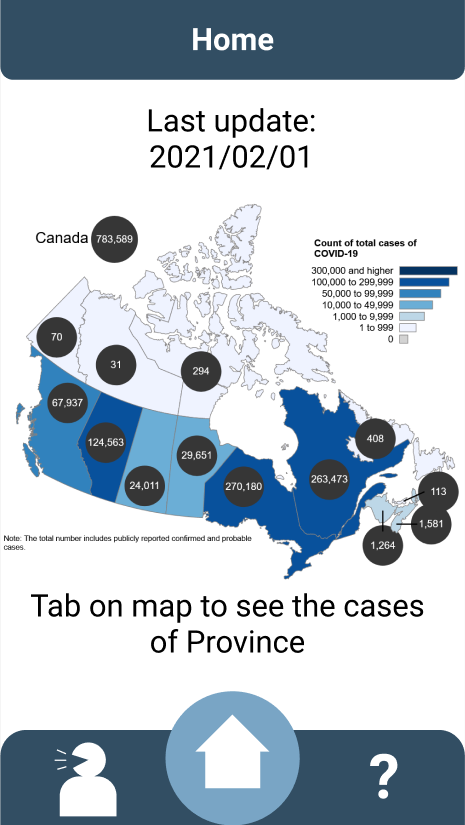

## Covid 19 Tracking App
### Features
* design for tracking lastest statistics of COVID-19 at Canada
* user can reading tips about COVID
* user can ask questions with volunteer through online chatting feature

### Top 5 unseen desired features for COVID 19 APP
* online chatting to ask question
* vaccine appointment booking and other relative info
* better compatibility for older mobile device 
* accurate COVID-19 alarm once enter the high risk area 
* font adjusting

### Demo
* Figma public link [here](https://www.figma.com/file/00I6SIVe4R9ksEhyZqHXxa/Covid19-app?node-id=0%3A1)
* demo video is included in this repository
* sample screens:

